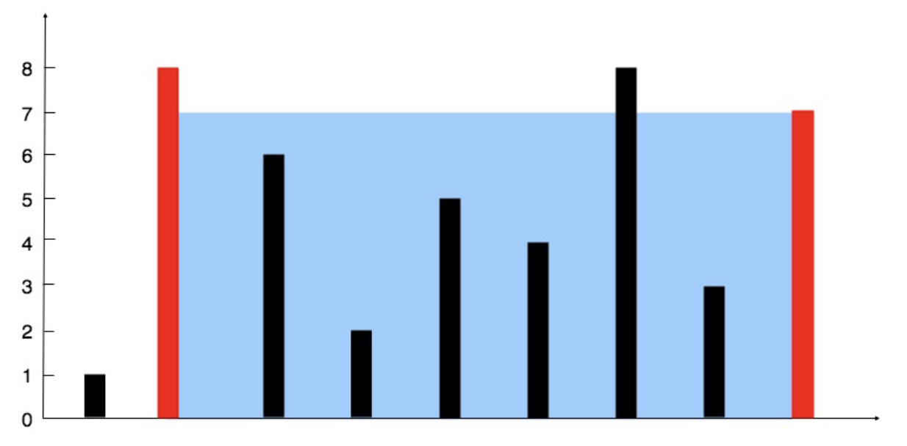

> 💡 **Not:** Bu soru **Two Pointers (İki İşaretçi)** kalıbı ile çözülmüştür. Kalıbın genel mantığı, kullanım senaryoları ve teorik detayları için [README.md](../README.md) dosyasına bakabilirsiniz.

# [11. Container With Most Water](https://leetcode.com/problems/container-with-most-water/)


You are given an integer array `height` where each element represents the height of a vertical line drawn on a coordinate plane. The distance between each line is 1 on the x-axis. Find two lines that, together with the x-axis, form a container capable of holding the maximum amount of water. Return this maximum area. You cannot slant the container.

### Example 1:


>**Input:** `height = [1,8,6,2,5,4,8,3,7]`  
**Output:** `49`  
**Explanation:** The maximum water is trapped between the lines at index 1 (height 8) and index 8 (height 7). The width is 7, and the limiting height is 7. Area = 7 * 7 = 49.

### Example 2:
>**Input:** `height = [1,1]`  
**Output:** `1`

---

### Türkçe Açıklama
Sana, x ekseni üzerinde çizilmiş dikey çizgilerin yüksekliklerini temsil eden bir `height` dizisi veriliyor. Bu çizgilerden herhangi ikisini seçerek, x ekseniyle birlikte içine en çok su alabilecek kabı oluşturman ve bu maksimum su miktarını (alanı) döndürmen isteniyor. Kabı eğemezsin.

---

### 1. Two Pointers Yaklaşımı (Optimal)

Su miktarını (alanı) maksimize etmek için **genişlik** (width) ve **yüksekliği** (height) dengelememiz gerekir. Suyun yüksekliği her zaman kısa olan çizgi tarafından sınırlandırılır (`min(height[left], height[right])`). 

Algoritmaya en geniş durumu test ederek başlarız: İşaretçilerin birini en başa, diğerini en sona koyarız. Genişlik her adımda daralacağı için alanı artırmanın tek yolu daha uzun çizgiler bulmaktır. Bu yüzden mantıksal olarak her zaman **kısa olan çizgiyi** gösteren işaretçiyi içe doğru kaydırarak daha uzun bir çizgi bulmayı umarız.

```python
class Solution:
    def maxArea(self, height: list[int]) -> int:
        # Space Complexity = O(1)
        left = 0
        right = len(height) - 1
        max_area = 0
        
        # Time Complexity = O(N)
        while left < right:
            w = right - left
            h = min(height[left], height[right])
            a = w * h
            max_area = max(max_area, a)
            
            # Kısa olan çizgiyi değiştir
            if height[left] < height[right]:
                left += 1
            else:
                right -= 1
                
        return max_area
```

**Time Complexity (Zaman Karmaşıklığı):** $O(N)$ Diziyi iki uçtan içe doğru sadece bir kez tararız.

**Space Complexity (Alan Karmaşıklığı):** $O(1)$ Sadece alan ve işaretçi takibi için birkaç değişken kullanıldığından ekstra belleğe ihtiyaç duyulmaz.

--- 

### 2. Brute Force Yaklaşımı (Time Limit Exceeded)

En düz mantık çözüm, iç içe iki döngü kullanarak dizideki her bir çizgi çifti için alanı hesaplamak ve en büyüğünü akılda tutmaktır.

```python
class SolutionBruteForce:
    def maxArea(self, height: list[int]) -> int:
        # Space Complexity = O(1)
        max_area = 0
        
        # Time Complexity = O(N^2)
        for i in range(len(height)):
            for j in range(i + 1, len(height)):
                w = j - i
                h = min(height[i], height[j])
                max_area = max(max_area, w * h)
                
        return max_area
```

**Time Complexity (Zaman Karmaşıklığı):** $O(N^2)$ Olası tüm eşleşmeleri test etmek büyük veri setlerinde kodun zaman aşımına uğramasına (TLE) sebep olur.

**Space Complexity (Alan Karmaşıklığı):** $O(1)$ Ekstra bellek kullanılmaz.