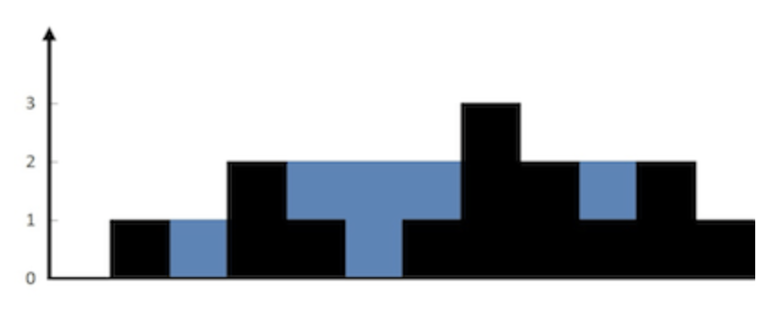

> 💡 **Not:** Bu soru **Two Pointers (İki İşaretçi)** kalıbı ile çözülmüştür. Kalıbın genel mantığı, kullanım senaryoları ve teorik detayları için [README.md](../README.md) dosyasına bakabilirsiniz.

# [42. Trapping Rain Water](https://leetcode.com/problems/trapping-rain-water/)

**Problem Statement**
Given `n` non-negative integers representing an elevation map where the width of each bar is `1`, compute how much water it can trap after raining.

### Example 1:


> **Input:** `height = [0,1,0,2,1,0,1,3,2,1,2,1]`  
> **Output:** `6`  
> **Explanation:** The above elevation map (black section) is represented by array `[0,1,0,2,1,0,1,3,2,1,2,1]`. In this case, 6 units of rain water (blue section) are being trapped.

### Example 2:
> **Input:** `height = [4,2,0,3,2,5]`  
> **Output:** `9`  

---

**Türkçe Açıklama**
Sana, her bir çubuğun genişliğinin `1` olduğu bir yükseklik haritasını temsil eden negatif olmayan tam sayılardan oluşan `n` uzunluğunda bir dizi veriliyor. Yağmur yağdıktan sonra bu haritanın ne kadar su tutabileceğini hesaplaman isteniyor.

---

### 1. Two Pointers Yaklaşımı (Optimal)

Tek bir bloğun üzerinde tutulabilecek su miktarı, onun solundaki ve sağındaki en yüksek duvarların minimum değerinden kendi yüksekliğinin çıkarılmasıyla bulunur. Önceden tüm bloklar için mutlak maksimumları hesaplayıp depolamak yerine, iki uçtan merkeze doğru ilerleyen iki işaretçi (Two Pointers) kullanabiliriz.

`leftMax` ve `rightMax` değerlerini anlık olarak takip ederek, su seviyesini hangi tarafın güvenli bir şekilde sınırlandırdığına karar veririz. Eğer `leftMax < rightMax` ise, ortadaki blokların yüksekliği ne olursa olsun `left` işaretçisinin bulunduğu noktadaki su seviyesinin `leftMax` tarafından sınırlandırıldığını kesin olarak biliriz. Suyun miktarını hesaplar, işaretçiyi içe kaydırır ve işlemi tekrarlarız. Suları anlık (on the fly) hesapladığımız için dizileri depolamamıza gerek kalmaz ve alan karmaşıklığı $O(1)$'e düşer.

```python
class Solution:
    def trap(self, height: list[int]) -> int:
        # Space Complexity = O(1) -> Ekstra hafıza (dizi vb.) kullanılmaz
        l = 0
        r = len(height) - 1
        leftMax = height[l]
        rightMax = height[r]
        res = 0
        
        # Time Complexity = O(N) -> Dizi uçlardan içe doğru tek seferde taranır
        while l < r:
            if leftMax < rightMax:
                l += 1
                leftMax = max(leftMax, height[l])
                res += max(0, leftMax - height[l])
            else:
                r -= 1
                rightMax = max(rightMax, height[r])
                res += max(0, rightMax - height[r])
                
        return res
```

**Time Complexity (Zaman Karmaşıklığı):** $O(N)$
İki işaretçi diziyi uçlardan başlayıp ortada buluşana kadar tam olarak bir kez tarar.
**Space Complexity (Alan Karmaşıklığı):** $O(1)$
Verileri önceden depolamak yerine sadece birkaç değişken (`l`, `r`, `leftMax`, `rightMax`) kullanarak ilerlediğimiz için ekstra hafızaya ihtiyaç duyulmaz.

--- 

### 2. Dynamic Programming / Prefix Arrays Yaklaşımı (Alternatif)

Anlık hesaplama yapmak yerine, dizideki her bir indeks için "kendisinden önceki en yüksek sol duvarı" ve "kendisinden sonraki en yüksek sağ duvarı" önceden bulup iki ayrı dizide (`max_left` ve `max_right`) saklayabiliriz. Ardından diziyi son bir kez dönüp her indeks için biriken suyu hesaplarız.

Mantığı kurması daha kolaydır ancak önceden hesaplanan bu referans duvar yüksekliklerini saklamak, bizi mecburi olarak ekstra hafıza kullanmaya iter.

```python
class SolutionAlternative:
    def trap(self, height: list[int]) -> int:
        # Space Complexity = O(N) -> N boyutunda iki ekstra dizi ayrılır
        l_wall = r_wall = 0
        n = len(height)
        max_left = [0] * n
        max_right = [0] * n
        
        # Time Complexity = O(N)
        for i in range(n):
            j = -i - 1
            max_left[i] = l_wall
            max_right[j] = r_wall
            l_wall = max(l_wall, height[i])
            r_wall = max(r_wall, height[j])
            
        summ = 0
        for i in range(n):
            pot = min(max_left[i], max_right[i])
            summ += max(0, pot - height[i])
            
        return summ
```

**Time Complexity (Zaman Karmaşıklığı):** $O(N)$
Dizi üzerinde yapılan birkaç tam tur tarama işlemi asimptotik olarak $O(N)$ kabul edilir.
**Space Complexity (Alan Karmaşıklığı):** $O(N)$
`max_left` ve `max_right` adında orijinal diziyle aynı boyutta (N) iki yeni liste oluşturulur.

---

### 3. Brute Force Yaklaşımı (Time Limit Exceeded)

Dizideki her bir eleman için, o elemanın en soluna kadar gidip en yüksek duvarı bulur, ardından en sağına kadar gidip diğer en yüksek duvarı buluruz. 

```python
class SolutionBruteForce:
    def trap(self, height: list[int]) -> int:
        # Space Complexity = O(1)
        res = 0
        n = len(height)
        
        # Time Complexity = O(N^2)
        for i in range(n):
            left_max = max(height[:i+1]) if i >= 0 else 0
            right_max = max(height[i:]) if i < n else 0
            res += min(left_max, right_max) - height[i]
            
        return res
```

**Time Complexity (Zaman Karmaşıklığı):** $O(N^2)$
İncelenen her bir $N$ elemanı için dizinin geri kalanı tekrar tarandığından, algoritma karesel zaman karmaşıklığına ulaşır ve büyük verilerde Time Limit Exceeded (TLE) hatası verir.
**Space Complexity (Alan Karmaşıklığı):** $O(1)$
Ekstra bellek kullanılmaz.