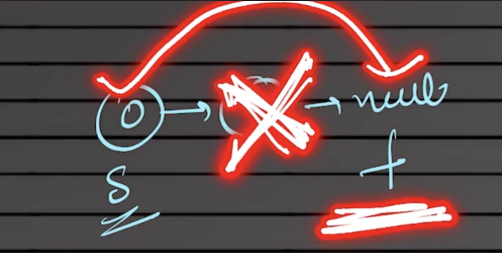

> 💡 **Note:** This problem is optimally solved using the **Fast and Slow Pointers** pattern. For the theoretical details of this pattern, refer to the [pattern README.md](../README.md).

# [0019. Remove Nth Node From End of List](https://leetcode.com/problems/remove-nth-node-from-end-of-list/)

Given the `head` of a linked list, remove the `n`th node from the end of the list and return its head.

### Example 1:
> **Input:** `head = [1,2,3,4,5], n = 2`  
> **Output:** `[1,2,3,5]`  
> **Explanation:** The 2nd node from the end is 4. Removing it leaves 1 -> 2 -> 3 -> 5.

### Example 2:
> **Input:** `head = [1], n = 1`  
> **Output:** `[]`  

### Example 3:
> **Input:** `head = [1,2], n = 1`  
> **Output:** `[1]`  

---

### 1. Fast and Slow Pointers Approach (Optimal / One-Pass)

While a brute force approach requires scanning the list twice, the Fast and Slow pointer technique allows us to find and remove the target node in a single traversal (One-pass). 

**The Dummy Node and $n+1$ Gap Logic:**
To remove a node in a singly linked list, our pointer must stop exactly *one node before* the target node. We achieve this by creating a `dummy` node that points to the `head`. 
Both `fast` and `slow` pointers start at this `dummy` node. We first move the `fast` pointer `n` steps ahead. Because they started one step behind the actual list (at the dummy), this effectively creates a gap that positions `slow` exactly one step behind the target node when `fast` reaches the end of the list.



Once `slow` is positioned right before the target, we bypass the target node with `slow.next = slow.next.next`.

**Why return `dummy.next` instead of `head`?**
If the node to be removed happens to be the very first node of the list, the original `head` variable will still point to that deleted node. The `dummy.next` always points to the true, updated head of the list, ensuring we don't return a removed node.

```python
# Definition for singly-linked list.
# class ListNode:
#     def __init__(self, val=0, next=None):
#         self.val = val
#         self.next = next
class Solution:
    def removeNthFromEnd(self, head: ListNode | None, n: int) -> ListNode | None:
        dummy = ListNode(0, head)
        slow = dummy
        fast = dummy
        
        for _ in range(n):
            fast = fast.next
            
        while fast.next:
            fast = fast.next
            slow = slow.next
            
        slow.next = slow.next.next
        
        return dummy.next
```

**Time Complexity:** `O(N)`  
We traverse the list only once (One-pass). This is practically faster and more cache-efficient than the two-pass approach.

**Space Complexity:** `O(1)`  
We only use a dummy node and two pointers, requiring constant extra space.

--- 

### 2. Find Length and Iterate (Brute Force / Two-Pass)

The most naive way to solve this is to traverse the list once to find its total length (`lenn`), and then traverse it a second time to reach the node just before the one we want to delete. 

**The Edge Case (Removing the Head):**
If the node we need to remove is the very first node of the list, the mathematical index for the previous node (`lenn - n - 1`) becomes `-1`. The `for` loop `range(0, -1)` will not execute, and a `NoneType` error will occur when trying to access `.next.next`. To fix this edge case, if the length of the list is equal to `n` (`lenn == n`), it means the head must be removed, so we simply return `head.next` directly.

```python
class SolutionBruteForce:
    def removeNthFromEnd(self, head: ListNode | None, n: int) -> ListNode | None:
        curr = head
        lenn = 0
        while curr:
            lenn += 1
            curr = curr.next
            
        if lenn == n:
            return head.next
            
        curr = head
        
        for i in range(0, lenn-n-1):
            curr = curr.next
            
        curr.next = curr.next.next
        return head
```

**Time Complexity:** `O(N)`  
Although the asymptotic complexity is $O(N)$, this requires traversing the list twice (Two-pass), totaling roughly $2N$ steps.

**Space Complexity:** `O(1)`  
We only use variables to store the length and the current node.