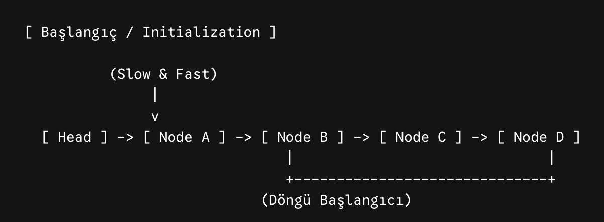
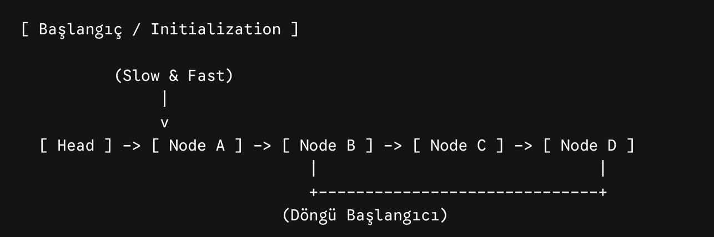
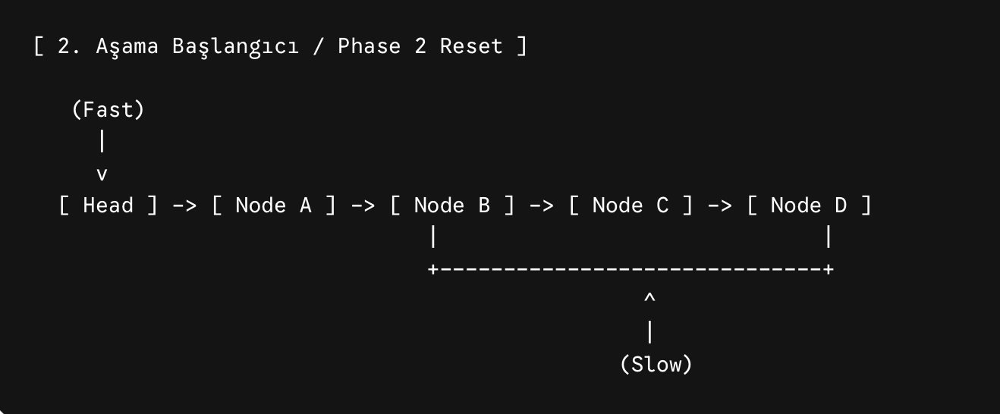
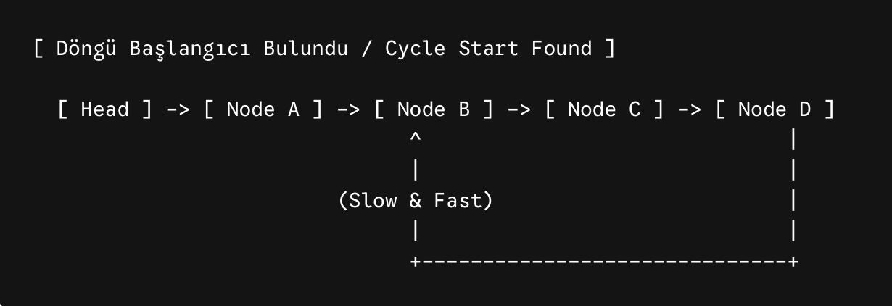
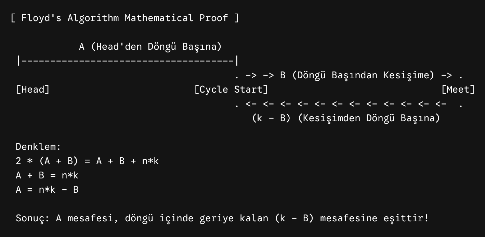

> 💡 **Note:** This problem is a direct extension of finding a cycle, optimally solved using the **Fast and Slow Pointers** pattern (specifically Floyd's Cycle-Finding Algorithm). For the theoretical details of this pattern, refer to the [pattern README.md](../README.md).

# [0142. Linked List Cycle II](https://leetcode.com/problems/linked-list-cycle-ii/)

Given the `head` of a linked list, return the node where the cycle begins. If there is no cycle, return `null`.

There is a cycle in a linked list if there is some node in the list that can be reached again by continuously following the `next` pointer. Internally, `pos` is used to denote the index of the node that tail's `next` pointer is connected to (0-indexed). It is `-1` if there is no cycle. **Note that `pos` is not passed as a parameter.**

**Do not modify** the linked list.

### Example 1:
> **Input:** `head = [3,2,0,-4], pos = 1`  
> **Output:** `tail connects to node index 1`  
> **Explanation:** There is a cycle in the linked list, where tail connects to the second node.

### Example 2:
> **Input:** `head = [1,2], pos = 0`  
> **Output:** `tail connects to node index 0`  
> **Explanation:** There is a cycle in the linked list, where tail connects to the first node.

---

### 1. Fast and Slow Pointers Approach (Optimal / Floyd's Algorithm)

To find the exact starting node of the cycle without using extra memory, we use the two-phase Floyd's Cycle-Finding Algorithm.

**Step 1: Initialization**
We start both `slow` and `fast` pointers at the `head` of the linked list.
<br>


**Step 2: Detect the Cycle (Phase 1)**
The `slow` pointer moves 1 step at a time, while the `fast` pointer moves 2 steps at a time. If there is a cycle, the `fast` pointer will eventually loop around and catch up to the `slow` pointer. The node where they meet confirms the existence of a cycle.
<br>


**Step 3: Reset Fast Pointer (Phase 2 Start)**
Once they meet, we know they are inside the cycle, but not necessarily at the start of it. To find the starting node, we leave the `slow` pointer exactly where it is (at the meeting point), and we move the `fast` pointer all the way back to the `head`.
<br>


**Step 4: Find the Cycle Start**
Now, we move **both** pointers exactly 1 step at a time. The fundamental math of Floyd's algorithm guarantees that the node where they collide again is the exact start of the cycle.
<br>


**The Mathematical Proof:**
Why does moving both one step at a time work perfectly? Let's break down the distances.
<br>


* `A` = Distance from the `head` to the cycle start.
* `B` = Distance from the cycle start to the meeting point.
* `k` = The total length of the cycle.
* `n` = The number of full loops the `fast` pointer made before they met.

1. Distance traveled by `slow`: $A + B$
2. Distance traveled by `fast`: $A + B + n \cdot k$
3. Since `fast` travels twice as fast as `slow`: $2 \cdot (A + B) = A + B + n \cdot k$
4. Simplify: $A + B = n \cdot k \implies A = n \cdot k - B$

This equation ($A = n \cdot k - B$) proves that the distance `A` is equal to the remaining distance in the cycle from the meeting point ($k - B$). Therefore, moving one pointer from the `head` and one from the meeting point at the same speed will cause them to meet exactly at the start of the cycle.

```python
# Definition for singly-linked list.
# class ListNode:
#     def __init__(self, x):
#         self.val = x
#         self.next = None

class Solution:
    def detectCycle(self, head: Optional[ListNode]) -> Optional[ListNode]:
        slow = head
        fast = head
        
        while (fast and fast.next):
            slow = slow.next
            fast = fast.next.next
            
            if slow == fast:
                fast = head
                while slow != fast:
                    slow = slow.next
                    fast = fast.next
                    
                return fast
                
        return None
```

**Time Complexity:** `O(N)`  
The first phase takes linear time to detect the cycle. The second phase takes at most linear time to find the start.

**Space Complexity:** `O(1)`  
Only pointer variables are used, requiring no extra memory scaling with the input.

--- 

### 2. Hash Set Approach (Brute Force / Naive)

If we are allowed to use extra space, the most straightforward way is to track every node we visit using a Hash Set. 

**The Core Logic:**
We iterate through the linked list. For every node, we check if it is already in our `sett`. The very first node we encounter that is *already* in the set is the exact node where the cycle begins. If we reach `null`, there is no cycle.

```python
class SolutionHashSet:
    def detectCycle(self, head: Optional[ListNode]) -> Optional[ListNode]:
        sett = set()
        curr = head
        
        while(curr):
            if curr in sett:
                return curr
                
            sett.add(curr)
            curr = curr.next
            
        return None
```

**Why write $O(N)$ for complexities?**
Big-O notation represents the upper bound (worst-case scenario) of an algorithm.

**Time Complexity:** `O(N)`  
If there is no cycle, we traverse the entire list ($N$ steps). If there is a cycle starting at index $k$, we stop there ($k \le N$ steps). The average time for set insertion (`add`) and lookup (`in`) is $O(1)$. Therefore, $N$ steps multiplied by $O(1)$ operations results in $O(N)$ total time complexity.

**Space Complexity:** `O(N)`  
* If there is no cycle (`pos = -1`), the `sett` absorbs all elements of the list, making its size exactly $N$. Thus, in the worst case, it definitely requires $O(N)$ extra space.
* If the cycle starts at index $k$, the set size becomes $k+1$. However, in asymptotic analysis, we ignore coefficients and lower bounds, focusing on the upper bound relative to the input size ($N$).